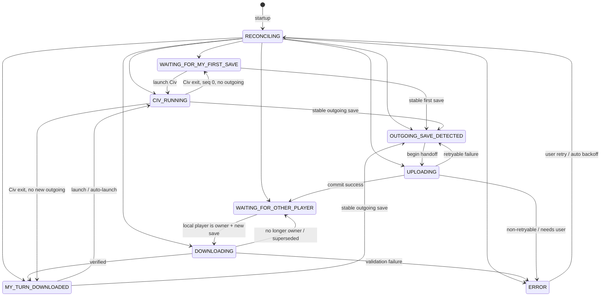

# Design specification — civ4-turn-relay

**Status:** Normative product design for protocol version 1 clients.
**Companion:** [`SYNC_PROTOCOL.md`](SYNC_PROTOCOL.md) (wire protocol, remote layout, algorithms).
**Language:** `MUST` / `SHOULD` / `MAY` as defined in [`AGENTS.md`](../AGENTS.md).

This document defines client product behavior. Protocol commit semantics, remote invariants, and concurrency outcomes live only in `SYNC_PROTOCOL.md`.

---

## 1. Goals and non-goals

### Goals

| ID | Goal |
|----|------|
| G-1 | Simple PBEM turn relay for two or more human players |
| G-2 | Compatible with Civilization IV: Beyond the Sword, including Advanced Civ |
| G-3 | Obvious current state: what the app believes and why |
| G-4 | Automatic discovery and transfer of completed PBEM saves |
| G-5 | Safe restart after application or Civilization crashes |
| G-6 | Useful diagnostics without exposing secrets |
| G-7 | Support for multiple configured matches |

Multiple matches MAY be configured. The first implementation MAY focus on one selected match at a time while preserving a multi-match configuration model.

### Non-goals (initial)

| ID | Non-goal |
|----|----------|
| NG-1 | Implementing Civilization game rules |
| NG-2 | Inspecting or modifying Civ save contents |
| NG-3 | A custom server daemon or game process on Linux |
| NG-4 | Real-time / simultaneous-turn multiplayer |
| NG-5 | PitBoss |
| NG-6 | Email delivery |
| NG-7 | Mobile or web clients |
| NG-8 | Silently controlling Civilization’s UI (clicking menus, ending turns, etc.) |

The application manages saves, verification, transfer, and launching only. It MUST NOT pretend to perform gameplay actions inside Civilization.

### Planned client stack (later implementation)

Python 3.12, PySide6, Paramiko (SFTP), Watchdog (filesystem events). Windows distribution (P9) MUST provide both a portable/distributable build (PyInstaller or selected equivalent) and a real Windows installer (Inno Setup or justified equivalent)—not only a standalone executable. The remote side is ordinary SFTP storage with no custom server-side process. Correctness comes from the client protocol and the authoritative server manifest ([`SYNC_PROTOCOL.md`](SYNC_PROTOCOL.md)). Packaging and installer requirements are owned by [`PHASE_PLAN.md` P9](PHASE_PLAN.md#p9--real-two-player-hardening-windows-packaging-ops-docs-release-readiness).

---

## 2. Users and assumptions

| Role / assumption | Definition |
|-------------------|------------|
| Human relay participant | A person whose civilization is in the ordered human player list and who runs a relay client for their player ID |
| Match creator | Creates the match configuration and publishes the first outgoing PBEM save |
| Joining participant | Imports or joins an existing match and waits for ownership before playing |
| Client platform | Windows is the initial supported client platform |
| Game installs | All humans MUST use compatible Civ IV / BTS / mod installations for the match |
| AI players | Handled entirely by Civilization; MUST NOT appear in the relay’s human turn order |

Civilization’s visible game turn number is not assumed to equal the protocol sequence. See terminology in [`SYNC_PROTOCOL.md`](SYNC_PROTOCOL.md#1-terminology).

---

## 3. End-to-end workflows

Legend: **Relay** = user action in the app · **Civ** = action inside Civilization · **Auto** = background relay behavior.

### 3.1 First-time application setup

| Step | Actor | Action |
|------|-------|--------|
| 1 | Relay | Enter global server settings (host, port, user, auth, remote root) and Civ launch profile(s) |
| 2 | Relay | Validate connectivity without logging secrets |
| 3 | Auto | Persist global config locally; secrets remain in local secret storage / `.env` (never committed) |

### 3.2 Creating a relay match

| Step | Actor | Action |
|------|-------|--------|
| 1 | Relay | Create match: stable game ID, display name, ordered human players, local player ID, mod, PBEM save location, launch profile |
| 2 | Auto | Persist per-match config locally; initialize remote match atomically per [`SYNC_PROTOCOL.md` §2.5](SYNC_PROTOCOL.md#25-initial-match-creation) (valid seq-0 `manifest.json` is the init commit point) |
| 3 | Auto | Enter `WAITING_FOR_MY_FIRST_SAVE` if this client owns the opening handoff |

### 3.3 Joining or importing a match

| Step | Actor | Action |
|------|-------|--------|
| 1 | Relay | Provide game ID (and display metadata as needed); select which human player this client owns |
| 2 | Auto | Fetch and validate remote manifest; refuse join if player ID is not in the human order |
| 3 | Auto | Enter `WAITING_FOR_OTHER_PLAYER` or download path if already current owner |

### 3.4 Creating the first PBEM save

| Step | Actor | Action |
|------|-------|--------|
| 1 | Relay / Auto | Before launch from `WAITING_FOR_MY_FIRST_SAVE`, record durable play-session baseline |
| 2 | Civ | Match creator creates the PBEM game and produces the first outgoing human save |
| 3 | Auto | Detect post-baseline outgoing candidate → verify → upload/commit per protocol |
| 4 | Auto | Transition to waiting for the next human in order |

### 3.5 Receiving and playing a normal turn

| Step | Actor | Action |
|------|-------|--------|
| 1 | Auto | Poll/fetch manifest; if local player is current owner and save is new, download and verify |
| 2 | Relay / Auto | Present `YOUR TURN` / `DIN TUR`; before launch, record durable play-session baseline; primary action launches Civ with mod + save (optional per-match auto-launch MAY run only after verified download) |
| 3 | Civ | Player completes turn and clicks **Next Turn** |

### 3.6 Detecting and sending the outgoing save

| Step | Actor | Action |
|------|-------|--------|
| 1 | Auto | Detect stable outgoing candidate whose hash is absent from baseline, incoming save, `accepted_save_hashes`, and locally processed outgoing hashes ([protocol §6](SYNC_PROTOCOL.md#6-outgoing-save-detection)) |
| 2 | Auto | Upload and commit handoff per protocol (auto-send only when baseline is trustworthy) |
| 3 | Auto | Show next expected human player |

### 3.7 Restart after application or Civilization crash

| Step | Actor | Action |
|------|-------|--------|
| 1 | Auto | On startup, reconcile using remote manifest, verified remote save, local cache, local files, hashes, operation journal, and whether Civ is running ([§9](#9-crash-recovery-and-repair-ux)) |
| 2 | Auto | Explain recovered state in the UI; resume polling / upload / wait as evidence requires |
| 3 | Relay | Use explicit repair only when automatic reconciliation cannot safely proceed |

### 3.8 Switching between configured matches

| Step | Actor | Action |
|------|-------|--------|
| 1 | Relay | Select another configured match |
| 2 | Auto | Pause active watchers/transfers for the previous selection as needed; reconcile the newly selected match |
| 3 | Auto | Present that match’s derived status only |

Switching matches MUST NOT alter any match’s remote ownership.

### 3.9 Repair and recovery workflow

| Step | Actor | Action |
|------|-------|--------|
| 1 | Relay | Open diagnostics / repair; review proposed action and preview |
| 2 | Relay | Confirm explicitly |
| 3 | Auto | Apply only protocol-allowed recovery; preserve history ([`SYNC_PROTOCOL.md`](SYNC_PROTOCOL.md#11-history-and-repair)) |

---

## 4. Configuration model

Server and installation settings MUST NOT be duplicated into every match. Secrets MUST NOT be committed; [`.env.example`](../.env.example) holds **global** placeholders only.

### 4.1 Global configuration

| Concept | Editable | In `.env` example | Notes |
|---------|----------|-------------------|-------|
| SFTP host, port, username | Yes | Yes | Validated by UI (format / reachability checks) |
| Authentication method / private key path / password | Yes | Yes | Stored locally as secrets; never logged |
| Server root | Yes | Yes | Remote base path for all games |
| Polling interval | Yes | Yes | Default 10 seconds |
| Log level | Yes | Yes | Local only |
| Civ installation / default executable / launch-profile seed | Yes | Optional executable seed | Working directory and named profiles MAY live in local global config files |

`.env` MUST NOT carry per-match identity, mod, PBEM save directory, or automatic-launch settings.

### 4.2 Per-match configuration

| Concept | Editable | Notes |
|---------|----------|-------|
| Stable match / game ID | Create-time | Format enforced by protocol; immutable after remote init |
| Display name | Yes | Local and/or mirrored in manifest display field |
| Ordered human player IDs and display names | Create / admin repair | Defines relay order; excludes AI |
| Local player ownership (`player_id` for this client) | Yes | MUST be one of the human IDs; **not** a global `.env` value |
| Launch profile | Yes | References a global profile |
| Mod name or path | Yes | Default concept: `AdvCiv`; per-match only |
| PBEM save location and matching rules | Yes | Directory + filename/pattern constraints; per-match only |
| Optional automatic launch | Yes | Default off; per-match only; MUST NOT create turn transitions |

### 4.3 Storage and validation

- User-editable values are those listed above.
- The UI SHOULD validate formats before save (game ID, paths, port range, player list non-empty and unique IDs).
- Local persistence MAY use `.env` for global secrets/settings plus per-match config files under the user data directory.
- Global SFTP settings apply to all matches under the configured server root.

---

## 5. Authority model

| Artifact | Authority |
|----------|-----------|
| Server manifest | Authoritative for protocol sequence and current human owner |
| Verified server save (hash-matched) | Authoritative game data for the accepted handoff |
| Local state | Cache and record of observations only |
| UI state | Derived presentation of local + remote evidence |

A detected filename, changed timestamp, timer tick, button click, or Civilization process state MUST NOT alone advance the protocol. Advancement occurs only through the commit algorithm in [`SYNC_PROTOCOL.md`](SYNC_PROTOCOL.md#7-upload-and-commit-algorithm).

---

## 6. Local operational states

Remote turn ownership is never changed by the UI. States below are local operational modes derived from evidence.

### 6.1 State diagram



`RECONCILING` and `DOWNLOADING` are transient correctness states. User-visible status SHOULD map them to short phrases (e.g. “Checking game state…”, “Downloading save…”) without implying ownership changes.

### 6.2 State catalog

| State | Meaning | Required evidence | Primary UI message | Primary action | Allowed transitions | Prohibited | Restart recovery |
|-------|---------|-------------------|--------------------|----------------|---------------------|------------|------------------|
| `RECONCILING` | Startup or post-error evidence merge | App start or explicit retry | Checking game state… | None / Cancel if long | Any stable state below | Treating reconcile as a handoff | Re-enter reconcile |
| `WAITING_FOR_MY_FIRST_SAVE` | This client must publish sequence 0→1 | Manifest seq 0 / no accepted save; local player is designated opener | Waiting for your first PBEM save | Start Civ (create game) | → `CIV_RUNNING`, `OUTGOING_SAVE_DETECTED`, `ERROR` | → `MY_TURN_DOWNLOADED` without remote save | Same if still opener and seq 0 |
| `WAITING_FOR_OTHER_PLAYER` | Another human owns the handoff | Manifest current player ≠ local | Waiting for {player} | None needed | → `DOWNLOADING`, `ERROR` | Upload commit | Same if still not owner |
| `DOWNLOADING` | Fetching accepted save for this player | Manifest says local is owner; download in progress | Downloading save… | None | → `MY_TURN_DOWNLOADED`, `WAITING_FOR_OTHER_PLAYER`, `ERROR` | Launch before verify | Resume or restart download |
| `MY_TURN_DOWNLOADED` | Verified incoming save ready | Local verified hash = manifest accepted hash; local is owner | YOUR TURN / DIN TUR | Start Civ and play | → `CIV_RUNNING`, `OUTGOING_SAVE_DETECTED`, `ERROR` | Upload incoming hash as new handoff | Restore this if evidence still holds |
| `CIV_RUNNING` | Civ process associated with this match is running | Process handle / PID observation; durable play-session baseline recorded at launch | Civilization is running | Focus / open folder (secondary) | → `OUTGOING_SAVE_DETECTED`, `MY_TURN_DOWNLOADED`, `WAITING_FOR_MY_FIRST_SAVE`, `ERROR` | Manifest rewrite because Civ started | If Civ still running → `CIV_RUNNING` with preserved baseline; else re-derive |
| `OUTGOING_SAVE_DETECTED` | Stable new outgoing candidate ready | Stable file; matching rules; hash absent from baseline, incoming, `accepted_save_hashes`, and locally processed outgoings | Outgoing save ready to send | Send now (or Auto sending…) | → `UPLOADING`, `ERROR` | Skip verify; auto-send without trustworthy baseline | Re-hash and reclassify per protocol §6.3; never treat older-hash replay as a new success |
| `UPLOADING` | Handoff commit in progress | Operation journal active | Uploading save… | None | → `WAITING_FOR_OTHER_PLAYER`, `OUTGOING_SAVE_DETECTED`, `ERROR` | Second concurrent commit for same match | Resume idempotent commit ([protocol](SYNC_PROTOCOL.md#7-upload-and-commit-algorithm)) |
| `ERROR` | Operator attention needed | Recorded failure context | Error: {specific} | Retry / Open diagnostics | → `RECONCILING` | Silent ignore | Show last error + reconcile |

---

## 7. Minimal UI

### 7.1 Main window contents

- Selected match (display name)
- One prominent status
- Current expected player (from manifest when available)
- Last successful event with timestamp
- One context-sensitive primary button
- Secondary controls: matches, settings, diagnostics

### 7.2 Examples

```text
AdvCivTest

STATUS: Waiting for Ljunget
Last event: Save uploaded at 21:43

[Nothing needs to be done]
```

```text
AdvCivTest

STATUS: YOUR TURN
Save downloaded and verified

[Start Civ and play]
```

Swedish `DIN TUR` and English `YOUR TURN` MAY both be supported; the status meaning MUST be identical.

### 7.3 Primary button by state

| State | Primary button | Behavior |
|-------|----------------|----------|
| `WAITING_FOR_MY_FIRST_SAVE` | Start Civ and create game | Launch Civ with configured mod (no incoming save required) |
| `WAITING_FOR_OTHER_PLAYER` | Disabled: Nothing needs to be done | No protocol effect |
| `DOWNLOADING` | Disabled: Downloading… | No protocol effect |
| `MY_TURN_DOWNLOADED` | Start Civ and play | Launch Civ with mod + verified incoming save |
| `CIV_RUNNING` | Disabled: Civilization is running | Optional secondary: reveal save folder |
| `OUTGOING_SAVE_DETECTED` | Send save (if not auto) | Start upload/commit; auto-send SHOULD be default when candidate is valid **and** a trustworthy play-session baseline exists |
| `UPLOADING` | Disabled: Uploading… | No protocol effect |
| `ERROR` | Retry | Re-enter `RECONCILING` / resume failed idempotent op |
| `RECONCILING` | Disabled: Checking… | No protocol effect |

Button presses MUST NOT mark a handoff accepted. Only a successful protocol commit does.

### 7.4 Error presentation

Every error MUST state:

1. What failed
2. Whether the turn and save are safe (ownership unchanged / save intact / unknown)
3. What the application will retry
4. What the user can do next

Avoid generic messages such as “No connection” without host, operation, and safety context.

---

## 8. Process and save detection behavior

### 8.1 Launching Civilization

- Launch MUST use the selected launch profile, configured mod, and—when playing a received turn—the verified incoming save path.
- Exact CLI flags are an integration detail; the design requires “mod + save” correctness, not save rewriting ([Open decisions](#13-open-decisions)).
- Immediately before launching from `WAITING_FOR_MY_FIRST_SAVE` or `MY_TURN_DOWNLOADED`, the client MUST record a durable play-session baseline of stable matching PBEM files and hashes ([`SYNC_PROTOCOL.md` §6.1](SYNC_PROTOCOL.md#61-play-session-baseline)).
- If Civilization is already running for this match, the client MUST NOT start a second instance by default; it SHOULD inform the user and keep `CIV_RUNNING` (baseline from the original launch MUST remain).
- If an unrelated Civ process is running, the client SHOULD warn before launch.

### 8.2 Outgoing save completion

A candidate MUST be accepted for `OUTGOING_SAVE_DETECTED` only when all hold:

- Path is under the match PBEM directory (recursive watch MAY be used)
- Filename/matching rules for the selected game pass
- File size is stable across at least two samples separated by a short interval (or equivalent lock/readability check)
- File is readable end-to-end for hashing
- Content SHA-256 is absent from the play-session baseline
- Content SHA-256 ≠ current verified incoming hash
- Content SHA-256 is absent from manifest `accepted_save_hashes`
- Content SHA-256 is absent from locally processed outgoing candidates
- A trustworthy baseline exists when auto-selecting; otherwise auto-send stops and an explained recovery/manual-selection path is required
- If multiple plausible post-baseline candidates exist, require user selection; do not guess

Filesystem events SHOULD trigger checks; polling at the global interval MUST remain a fallback. Timestamps and events MUST NOT establish identity or handoff validity. An overwritten path is acceptable only if its new content hash satisfies the rules above. Normative detail: [`SYNC_PROTOCOL.md` §6](SYNC_PROTOCOL.md#6-outgoing-save-detection).

### 8.3 Stale, partial, duplicate, unrelated

| Case | Behavior |
|------|----------|
| Partial write | Wait until stable; do not hash/upload |
| Duplicate event / same hash | Idempotent no-op |
| Unrelated save / other game | Ignore |
| File present before launch (in baseline) | Not an automatic outgoing candidate |
| Stale/replay hash in `accepted_save_hashes` | No remote advance; classify per protocol §6.3 (reject incoming; idempotent ack only for sender reconcile; older hash → stale/replay) |
| Incoming file copied into PBEM folder | Reject as outgoing (same hash as incoming / latest accepted for recipient) |
| Missing/corrupt baseline | Disable auto-send; explained manual recovery |

### 8.4 Civilization closes without outgoing save

- If protocol sequence remains `0`, no accepted save exists, and no valid outgoing candidate was produced → transition `CIV_RUNNING` → `WAITING_FOR_MY_FIRST_SAVE`.
- Otherwise, when a verified incoming turn was in play → transition `CIV_RUNNING` → `MY_TURN_DOWNLOADED`.

Explain that no new outgoing save was detected. Do not change remote ownership.

### 8.5 Auto-launch boundaries

Optional **per-match** auto-launch MAY start Civ only after a save is fully verified and the state is `MY_TURN_DOWNLOADED`, and only after the play-session baseline is recorded. Auto-launch MUST NOT upload, alter manifests, or advance protocol sequence.

---

## 9. Crash recovery and repair UX

### 9.1 Startup reconciliation inputs

1. Authoritative remote manifest (including `accepted_save_hashes`)
2. Verified remote save object (full read-back SHA-256)
3. Local cache (last sequence/hash, paths)
4. Local incoming and outgoing files
5. Recorded hashes, operation journal, and play-session baseline
6. Whether Civilization is running
7. Remote upload-lock presence/metadata (never auto-delete foreign locks)

The program MUST explain the recovered state rather than guess silently from filenames alone. If the play-session baseline is missing or corrupt while outgoing detection would otherwise run, auto-send MUST stop pending explicit recovery.

### 9.2 Repair rules

- Repair actions MUST be explicit, previewed, and confirmed.
- Repair MUST NOT silently delete history or overwrite the authoritative accepted save.
- Abandoned foreign upload-lock removal and incomplete match-directory repair require confirmation that the original process is stopped / that overwrite is intended; both MUST be logged clearly.
- Protocol-level repair semantics: [`SYNC_PROTOCOL.md`](SYNC_PROTOCOL.md#11-history-and-repair).

---

## 10. Logging and diagnostics

### 10.1 Logs

Structured, human-readable local logs MUST include where applicable:

- game ID
- operation ID
- protocol sequence
- state transition
- filenames where safe
- abbreviated hashes
- retry and error context

Logs MUST NEVER include passwords, private keys, or secret environment values.

### 10.2 Diagnostics view / export

Diagnostics SHOULD help a non-technical player classify problems as:

| Class | Examples |
|-------|----------|
| Local | Missing Civ path, save folder unreadable |
| Network | Timeout, DNS failure |
| Authentication | Key rejected, auth failure (no secret echoed) |
| Remote state | Manifest invalid, foreign lock held (possibly abandoned after informational threshold), wrong owner, incomplete match init |
| Invalid save | Hash mismatch, size mismatch, unstable file, stale/replay candidate |

Export MAY attach redacted logs and last manifest metadata (no secrets).

---

## 11. Functional requirements and acceptance criteria

| ID | Requirement | Acceptance criteria |
|----|-------------|---------------------|
| FR-001 | Initial handoff | Creator’s first stable save commits seq 0→1; next human becomes current; joiner can download |
| FR-002 | Normal alternating handoffs | Only current human can commit; sequence increments once per accepted save; next player derived from order |
| FR-003 | Duplicate file events | Re-seeing the same outgoing hash does not double-advance ([protocol tests](SYNC_PROTOCOL.md#13-protocol-test-matrix)) |
| FR-004 | Application restart | After kill mid-wait/download/upload, reconcile restores a correct non-guessed state; baseline survives when Civ still running |
| FR-005 | Network interruption | Interrupted ops leave ownership unchanged or eventually consistent via idempotent retry |
| FR-006 | Wrong-player upload | Non-owner commit attempt fails; manifest unchanged |
| FR-007 | Partial upload | Temp objects never become accepted; retry safe |
| FR-008 | Stale local save / historical replay | Hash in `accepted_save_hashes` cannot advance again; older hashes are not new successes |
| FR-009 | Concurrent polling | Two clients polling: at most one successful new handoff for a given new hash |
| FR-010 | Civ produces no save | Civ exit without candidate → `MY_TURN_DOWNLOADED` or `WAITING_FOR_MY_FIRST_SAVE` (seq 0); remote unchanged |
| FR-011 | Multiple matches | Switching selected match changes presentation only; other matches’ remote state untouched |
| FR-012 | Secret redaction | Logs, UI errors, and diagnostics export contain no passwords, keys, or secret env values |
| FR-013 | Play-session baseline | Pre-launch files are not auto-sent; missing baseline disables auto-send |
| FR-014 | Foreign locks | Never auto-broken; abandoned removal only via confirmed repair |

---

## 12. Testing principles

Product-level principles only. Detailed protocol cases: [`SYNC_PROTOCOL.md`](SYNC_PROTOCOL.md#13-protocol-test-matrix). Implementation gates: future `PHASE_PLAN.md`.

1. Domain and protocol logic MUST be testable without GUI, real SFTP, or real Civ saves.
2. Fake storage adapters MUST inject failures at every commit step.
3. UI tests SHOULD assert presentation and that actions only invoke domain/protocol APIs.
4. Integration tests against SFTP MAY come later; they MUST use disposable credentials and never require production infrastructure in CI.
5. Changing an invariant requires updating the protocol test matrix and automated coverage.

---

## 13. Open decisions

| Topic | Recommendation |
|-------|----------------|
| Exact Civ IV CLI for mod + save | Confirm empirically on BTS/AdvCiv during launch-integration phase; keep launcher behind an adapter interface now |
| Default auto-send vs manual Send | Auto-send after valid `OUTGOING_SAVE_DETECTED` when a trustworthy baseline exists |
| Default per-match auto-launch | Off |
| Stable-file sampling interval | 1.0s between size samples, twice; make configurable later if needed |
| Host-key policy | Verify against pinned host key / known_hosts; refuse on mismatch (no silent insecure accept) |

Lock fencing, atomic rename, full remote read-back, save path naming, and informational abandoned-lock display are decided in [`SYNC_PROTOCOL.md`](SYNC_PROTOCOL.md#14-open-decisions) and MUST NOT be weakened here.
