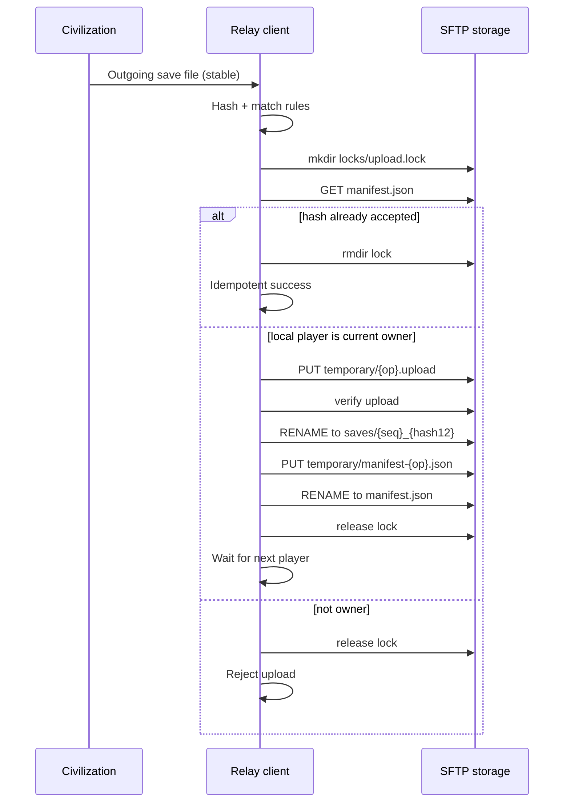

# Sync protocol v1 — civ4-turn-relay

**Status:** Normative wire and storage protocol for interoperable clients.
**Companion:** [`DESIGN_SPEC.md`](DESIGN_SPEC.md) (product/UI/local states).
**Language:** `MUST` / `SHOULD` / `MAY` as defined in [`AGENTS.md`](../AGENTS.md).

Two independent client implementations that obey this document MUST be able to hand off PBEM saves safely on dumb SFTP storage. Correctness MUST NOT depend on a custom server process.

---

## 1. Terminology

| Term | Meaning |
|------|---------|
| Civilization game turn | Internal Civ progression; **not** assumed equal to one human handoff |
| Human PBEM handoff | One human finishing play and producing the next human’s save |
| Protocol sequence | Integer count of **accepted** human handoffs (`0` = no accepted save yet) |
| Sender | Human player ID that produced the newly accepted save |
| Current / expected player | `current_player_id` in the manifest — the only human allowed to submit the next new save |
| Incoming save | Local verified copy of the remote accepted save for the current player to play |
| Outgoing save | Local Civ-produced save candidate intended for the next handoff |
| Accepted save | Remote save object referenced by the committed manifest |
| Local observation | Durable client record of what was seen/done; never overrides remote ownership |
| Committed manifest state | Contents of `manifest.json` after atomic replace — the remote commit point |

---

## 2. Remote layout

Under the globally configured server root:

```text
{server_root}/games/{game_id}/
    manifest.json
    saves/
    temporary/
    locks/
    history/
```

### 2.1 Game ID

| Rule | Value |
|------|-------|
| Pattern | `^[a-z][a-z0-9-]{1,62}[a-z0-9]$` (length 3–64) |
| Examples (placeholders) | `advciv-test`, `pbem-match-01` |
| Rejected | Uppercase, path separators, `.`, `..`, spaces, empty |

Clients MUST validate `game_id` before any path join. Clients MUST resolve remote paths so the final path stays strictly under `{server_root}/games/{game_id}/` (path-traversal protection).

### 2.2 Artifact roles

| Path | Role | Mutability |
|------|------|------------|
| `manifest.json` | Authoritative match state; **commit point** | Replaced atomically as a whole |
| `saves/{seq:06d}_{sha256[:12]}{ext}` | Accepted save objects | Immutable after publish |
| `temporary/` | Uploads and staging | Disposable |
| `locks/upload.lock/` | Per-game upload lock directory | Ephemeral |
| `history/manifest-{seq:06d}-{manifest_sha256[:12]}.json` | Prior committed manifests | Immutable |

`{ext}` is the original save extension (e.g. `.CivBeyondSwordSave`). Sequence-addressed names include a hash prefix for collision clarity; content identity remains the full SHA-256 in the manifest.

### 2.3 Permissions assumptions

- All relay participants share SFTP credentials that can read/write the game directory tree.
- The server is trusted for storage durability, not for protocol logic.
- Clients SHOULD use restrictive local file permissions for caches and secrets.

### 2.4 Commit point

Only atomic replacement of `manifest.json` commits a new handoff. Presence of objects under `temporary/` or unreferenced files under `saves/` MUST NOT advance ownership.

---

## 3. Manifest schema

### 3.1 Fields (schema version 1)

| Field | Type | Required | Description |
|-------|------|----------|-------------|
| `schema_version` | integer | yes | `1` for this document |
| `game_id` | string | yes | Stable ID; MUST match directory |
| `display_name` | string | yes | Human label |
| `players` | array | yes | Ordered human players only |
| `players[].id` | string | yes | Stable player ID (`^[a-z][a-z0-9_-]{0,31}$`) |
| `players[].display_name` | string | yes | UI label |
| `protocol_sequence` | integer | yes | Accepted handoff count; `≥ 0` |
| `current_player_id` | string | yes | MUST be one of `players[].id` |
| `last_sender_id` | string \| null | yes | `null` iff `protocol_sequence == 0` |
| `accepted_save` | object \| null | yes | `null` iff `protocol_sequence == 0` |
| `accepted_save.sha256` | string | if save | 64 lowercase hex chars |
| `accepted_save.size_bytes` | integer | if save | Exact byte length |
| `accepted_save.remote_path` | string | if save | Path relative to game root, under `saves/` |
| `accepted_save.original_filename` | string | if save | Basename only; not an identity |
| `accepted_save.accepted_at` | string | if save | UTC timestamp |
| `previous_manifest_ref` | string \| null | yes | History filename or `null` for first commit |
| `protocol` | object | yes | Recovery metadata |
| `protocol.min_client_protocol` | integer | yes | `1` |
| `protocol.last_operation_id` | string \| null | yes | UUID of last successful commit op |

AI civilizations MUST NOT appear in `players`.

### 3.2 Serialization conventions

- JSON object; UTF-8; no BOM.
- Clients SHOULD write manifests with keys in stable lexicographic order and `LF` newlines when producing bytes for `manifest_sha256` of history filenames.
- Integers are JSON numbers without fractions.
- Timestamps MUST be UTC ISO-8601 with seconds and `Z` suffix: `YYYY-MM-DDTHH:MM:SSZ`.
- SHA-256 digests MUST be lowercase hexadecimal.

### 3.3 Example (placeholders only)

```json
{
  "accepted_save": {
    "accepted_at": "2026-08-10T19:43:00Z",
    "original_filename": "ExampleMatch_PlayerA.CivBeyondSwordSave",
    "remote_path": "saves/000001_a1b2c3d4e5f6.CivBeyondSwordSave",
    "sha256": "a1b2c3d4e5f6789012345678abcdef9012345678abcdef9012345678abcdef90",
    "size_bytes": 1234567
  },
  "current_player_id": "player_b",
  "display_name": "Example Match",
  "game_id": "example-match",
  "last_sender_id": "player_a",
  "players": [
    {"display_name": "Player A", "id": "player_a"},
    {"display_name": "Player B", "id": "player_b"}
  ],
  "previous_manifest_ref": "history/manifest-000000-0123456789ab.json",
  "protocol": {
    "last_operation_id": "11111111-2222-3333-4444-555555555555",
    "min_client_protocol": 1
  },
  "protocol_sequence": 1,
  "schema_version": 1
}
```

Initial empty match (`protocol_sequence: 0`) has `accepted_save: null`, `last_sender_id: null`, `previous_manifest_ref: null`, and `current_player_id` set to the designated first human.

---

## 4. Invariants

Clients MUST enforce:

| ID | Invariant |
|----|-----------|
| INV-01 | Only the manifest’s `current_player_id` may submit the next **new** save |
| INV-02 | A save hash already accepted MUST NOT advance the sequence again |
| INV-03 | One accepted handoff increments `protocol_sequence` by exactly one |
| INV-04 | Accepted saves under `saves/` are immutable |
| INV-05 | The manifest references only a fully uploaded and verified save |
| INV-06 | Atomic replace of `manifest.json` is the sole remote commit point |
| INV-07 | Local cache MUST NOT override remote ownership |
| INV-08 | Retries are idempotent with respect to sequence advancement |
| INV-09 | Filenames and timestamps are not identities; SHA-256 is |
| INV-10 | Temporary or orphaned objects MUST NOT advance the game |
| INV-11 | AI players are not members of the relay order |
| INV-12 | Secrets MUST NEVER appear in remote manifests or history |

---

## 5. Download algorithm

When polling or after notification that the local player may be current owner:

1. Read `manifest.json` and validate schema + `game_id`.
2. If `current_player_id` ≠ local player → remain waiting; stop.
3. If `protocol_sequence == 0` or `accepted_save == null` → not a downloadable turn for a joiner; creator follows first-save flow.
4. Compare `protocol_sequence` and `accepted_save.sha256` with local durable records.
5. If already verified locally for that sequence+hash → no-op; expose `MY_TURN_DOWNLOADED` if applicable.
6. Download remote object to a unique temporary local path.
7. Verify `size_bytes` and SHA-256 of the complete file.
8. Atomically rename into the playable incoming path for the match.
9. Durably record observation (sequence, hash, path, time).
10. Expose local state `MY_TURN_DOWNLOADED` ([design states](DESIGN_SPEC.md#6-local-operational-states)).

Repeated polling after the same accepted save is verified MUST be a no-op regarding network fetch (beyond cheap manifest reads).

---

## 6. Outgoing-save detection

| Step | Rule |
|------|------|
| Scope | Only files under the selected match’s PBEM directory tree |
| Relevance | Matching rules from per-match config; ignore other games |
| Stability | Size unchanged across stability samples; file fully readable |
| Identity | Hash content (SHA-256); do not trust filename as identity |
| Reject incoming | If hash equals current verified incoming hash → not outgoing |
| Reject accepted | If hash equals manifest `accepted_save.sha256` → already processed |
| Multiple candidates | Prefer newest stable candidate whose hash is novel; if ambiguous, surface diagnostics and do not auto-commit |
| Transition | Enter `OUTGOING_SAVE_DETECTED` only with stable path + size + sha256 recorded |

---

## 7. Upload and commit algorithm

### 7.1 Lock primitive

**Primitive:** atomic directory creation of:

```text
{game_root}/locks/upload.lock/
```

OpenSSH SFTP `mkdir` fails if the directory exists. Clients MUST treat successful `mkdir` as lock acquisition.

Inside the lock directory, write `lock.json` (best-effort after mkdir) containing:

| Field | Description |
|-------|-------------|
| `operation_id` | UUID for this attempt |
| `client_id` | Stable local installation ID |
| `player_id` | Local human player ID |
| `created_at` | UTC timestamp |
| `expires_at` | UTC timestamp (recommended TTL: **15 minutes**) |

**Stale locks:** A client MUST NOT remove another client’s lock merely because it wants to upload. A client MAY delete a lock directory only if **all** hold:

1. `expires_at` is strictly in the past (or `lock.json` missing/unreadable **and** lock directory mtime older than 2× TTL), and
2. The client re-reads `manifest.json` and confirms no commit raced, and
3. The break is recorded in local diagnostics.

Casual lock breaking that could allow two concurrent committers MUST NOT be done. If unsure, fail with a clear “lock held” error and retry later.

**Release:** Remove `lock.json` then remove `upload.lock/` (order best-effort; empty/missing is fine).

If the storage adapter cannot provide atomic `mkdir` failure semantics, it MUST report that protocol guarantees cannot be met; clients MUST refuse to commit via that adapter.

### 7.2 Rename assumptions

Commit steps that require atomicity depend on OpenSSH SFTP rename/replace behavior:

- Save publish: `rename` from `temporary/` → final `saves/` path MUST fail if the destination exists (no silent overwrite), or the client MUST use a unique final name and never rewrite.
- Manifest commit: clients MUST upload `temporary/manifest-{operation_id}.json`, then `rename` over `manifest.json`.

If the server cannot atomically replace `manifest.json`, the adapter MUST signal incapability. Overwriting with non-atomic read-modify-write without rename is forbidden for commits.

### 7.3 Handoff steps

While local player believes they may submit:

1. Compute outgoing save SHA-256 and `size_bytes`.
2. Acquire `locks/upload.lock/` via atomic mkdir; write `lock.json`.
3. Re-read and validate authoritative `manifest.json` while holding the lock.
4. If `accepted_save.sha256` equals this outgoing hash → treat as **success** (idempotent); do not increment; release lock; update local records.
5. Verify `current_player_id` equals local player; else abort, release lock, no change.
6. Determine next human: next entry after sender in `players` order, wrapping to index 0.
7. Upload save to `temporary/{operation_id}.upload{ext}`.
8. Re-download or remote-stat+hash verify the uploaded object (size + SHA-256).
9. Atomically move to immutable final path `saves/{next_seq:06d}_{sha256[:12]}{ext}` where `next_seq = protocol_sequence + 1`.
10. Copy current manifest bytes into `history/` under `previous_manifest_ref` naming if not already present.
11. Construct new manifest: `protocol_sequence = next_seq`, `last_sender_id = local`, `current_player_id = next human`, new `accepted_save`, `previous_manifest_ref` set, `protocol.last_operation_id = operation_id`.
12. Validate new manifest in memory.
13. Write to `temporary/manifest-{operation_id}.json`.
14. Atomically rename/replace → `manifest.json` (**commit point**).
15. Durably record local success (sequence, hash, operation_id).
16. Release lock; transition toward `WAITING_FOR_OTHER_PLAYER`.

Failure before step 14 leaves ownership unchanged. After step 14, peers MUST observe the new owner even if the sender crashes before step 15.

### 7.4 Sequence diagram



---

## 8. Idempotence and concurrency

| Case | Authoritative outcome | Safe retry |
|------|-----------------------|------------|
| Duplicate filesystem events | Same hash → single candidate | Re-hash; no second commit |
| Repeated button presses | At most one in-flight op per match | Second press ignored or joins same op |
| Retry after unknown upload result | Re-acquire lock; re-read manifest | If hash accepted → success; else resume |
| Two clients polling | Manifest read-only; no advance | N/A |
| Two instances same player | Lock serializes commits | Loser waits/retries; INV-02 holds |
| Stale manifest read | Lock + re-read before commit | Abort if no longer owner |
| Reconnect after network loss | Remote manifest wins | Resume download/upload algorithms |
| Save uploaded, manifest not committed | Orphan save possible; ownership unchanged | Retry from lock; may re-upload or reuse verified temp if still present |
| Manifest committed, client missed success | Remote already advanced | Next lock+read sees accepted hash → idempotent success |
| Duplicate accepted hash from older sequence | Impossible for new commit: hash equality short-circuits at step 4; sequence does not move | Mark local success |

---

## 9. Crash-point analysis

| Crash point | Remote ownership | Orphans | Recovery |
|-------------|------------------|---------|----------|
| Before temporary upload | Unchanged | None | Restart detection/upload |
| During upload | Unchanged | Partial temp | Delete/ignore temp; retry |
| After upload, before final rename | Unchanged | Temp object | Retry; re-upload or rename if complete+valid |
| After final save rename, before manifest write | Unchanged | Unreferenced save in `saves/` | Harmless; retry builds manifest pointing at same hash path or identical content path |
| During manifest write (temp only) | Unchanged | Temp manifest | Retry |
| After manifest replace, before local confirm | **New owner committed** | None material | Local reconcile reads manifest; idempotent success |
| While downloading | Unchanged | Local temp | Discard partial; re-download |
| While launching / running Civ | Unchanged | None | Restore `CIV_RUNNING` or play/wait state from evidence |

Orphaned temporary files or unreferenced final saves MUST be cleanable by a future maintenance pass without changing `current_player_id`.

---

## 10. Local persistence

Minimum durable local record per match:

| Record | Purpose |
|--------|---------|
| Last verified manifest sequence + accepted hash | Skip redundant downloads; detect remote movement |
| Downloaded-save path + hash | Launch + reject-as-outgoing |
| Outgoing candidate hash + path + size | Resume upload |
| Operation IDs + journal (step reached) | Crash resume |
| Last successful local state transition | UI explanation |
| Retry counters / last error class | Diagnostics |

Protocol truth remains remote. Local records explain recovery and avoid duplicate work; on conflict, manifest wins ([INV-07](#4-invariants)).

---

## 11. History and repair

- Every successful commit SHOULD leave the previous manifest immutable under `history/`.
- Repair or rollback MUST NOT silently mutate an old accepted handoff’s save bytes.
- Prefer a new explicit recovery commit (new `operation_id`, new sequence increment only if publishing a replacement save under normal rules) or an administrative procedure that preserves prior manifests and saves.
- Automated cleanup MAY delete `temporary/` objects older than a threshold and unreferenced orphan saves **only after** confirming they are not `accepted_save.remote_path`.
- Any action that changes ownership outside normal handoff MUST require manual confirmation in the UI ([design repair UX](DESIGN_SPEC.md#9-crash-recovery-and-repair-ux)).

---

## 12. Security

| Topic | Rule |
|-------|------|
| Game ID / filenames | Validate against allowlists; basenames only for `original_filename` |
| Remote-path containment | Reject `..`, absolute paths, and escapes from game root |
| Host-key verification | MUST verify; refuse mismatch ([design open decisions](DESIGN_SPEC.md#13-open-decisions)) |
| SSH key / password | Local secrets only; prefer keys; never write into manifests |
| Secret redaction | Logs and exports redact credentials and secret env values |
| Untrusted manifest | Validate types, ranges, player uniqueness, referential integrity before use |
| Max save size | MUST enforce a configured limit (recommendation: **256 MiB**) |
| JSON limits | Cap players (recommendation: **32**), string lengths, and reject unknown critical contradictions |
| DoS posture | Small trusted-player system: rely on auth + size caps + lock TTL; no public anonymous upload |

---

## 13. Protocol test matrix

Tests MUST run against an in-memory or local-filesystem fake storage adapter with failure injection. No real infrastructure, credentials, or Civ save binaries are required (synthetic bytes suffice).

| Test ID | Scenario | Expected |
|---------|----------|----------|
| PT-01 | Owner commits new hash | seq+1; next player; save immutable |
| PT-02 | Non-owner commit | Reject; manifest unchanged |
| PT-03 | Duplicate commit same hash | Success idempotent; seq unchanged |
| PT-04 | Double mkdir lock | Second fails; no split brain |
| PT-05 | Crash after temp upload | Ownership unchanged; retry succeeds once |
| PT-06 | Crash after save rename, before manifest | Ownership unchanged; retry commits once |
| PT-07 | Crash after manifest replace | Peer sees new owner; sender reconcile idempotent |
| PT-08 | Download hash mismatch | Leave wait/error; no playable promote |
| PT-09 | Download retry same seq | Single playable file; no duplicate advance |
| PT-10 | Partial/unstable local file | No upload |
| PT-11 | Incoming hash as outgoing | Reject |
| PT-12 | Stale local candidate vs newer remote | Cannot overwrite newer accepted |
| PT-13 | Two pollers, one committer | One advance |
| PT-14 | Two instances same player | Lock + idempotence ⇒ one advance |
| PT-15 | Manifest schema invalid | Reject; no state advance |
| PT-16 | Path traversal game_id | Reject before I/O |
| PT-17 | Orphan temp cleanup | Ownership unchanged |
| PT-18 | Seq 0 first save | null→accepted; first→second player |
| PT-19 | Three humans wrap-around | Next player correct at end of order |
| PT-20 | Injected rename incapability | Adapter error; no false commit |
| PT-21 | Stale lock past TTL | Break only per §7.1 rules |
| PT-22 | Live lock within TTL | No break; clear error |

Later SFTP integration tests MAY reuse the same cases against a disposable server.

---

## 14. Open decisions

| Topic | Recommendation |
|-------|----------------|
| Lock TTL | 15 minutes; stale break only per §7.1 |
| Final save naming | Sequence + hash12 prefix as specified (§2.2) |
| Verify upload method | Prefer re-hash via read-back when feasible; else size + separate checksum channel if added later |
| History retention | Keep all history manifests by default; add pruning policy only after operational need |
