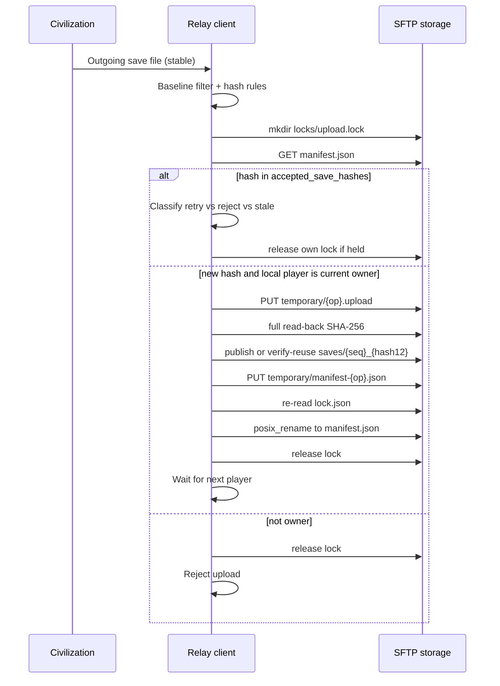

# Sync protocol v1 — civ4-turn-relay

**Status:** Normative wire and storage protocol for interoperable clients.
**Companion:** [`DESIGN_SPEC.md`](DESIGN_SPEC.md) (product/UI/local states).
**Language:** `MUST` / `SHOULD` / `MAY` as defined in [`AGENTS.md`](../AGENTS.md).

Two independent client implementations that obey this document MUST be able to hand off PBEM saves safely on dumb SFTP storage. Correctness MUST NOT depend on a custom server process.

---

## 1. Terminology

| Term | Meaning |
|------|---------|
| Civilization game turn | Internal Civ progression; **not** assumed equal to one human handoff |
| Human PBEM handoff | One human finishing play and producing the next human’s save |
| Protocol sequence | Integer count of **accepted** human handoffs (`0` = no accepted save yet) |
| Sender | Human player ID that produced the newly accepted save |
| Current / expected player | `current_player_id` in the manifest — the only human allowed to submit the next **new** save |
| Incoming save | Local verified copy of the remote accepted save for the current player to play |
| Outgoing save | Local Civ-produced save candidate intended for the next handoff |
| Accepted save | Remote save object referenced by the committed manifest |
| Accepted save hashes | Authoritative append-only list of every historically accepted save SHA-256 |
| Play-session baseline | Durable local snapshot of matching PBEM files/hashes recorded before launching Civ |
| Local observation | Durable client record of what was seen/done; never overrides remote ownership |
| Committed manifest state | Contents of `manifest.json` after atomic replace — the remote commit point |

---

## 2. Remote layout

Under the globally configured server root:

```text
{server_root}/games/{game_id}/
    manifest.json
    saves/
    temporary/
    locks/
    history/
```

### 2.1 Game ID

| Rule | Value |
|------|-------|
| Pattern | `^[a-z][a-z0-9-]{1,62}[a-z0-9]$` (length 3–64) |
| Examples (placeholders) | `advciv-test`, `pbem-match-01` |
| Rejected | Uppercase, path separators, `.`, `..`, spaces, empty |

Clients MUST validate `game_id` before any path join. Clients MUST resolve remote paths so the final path stays strictly under `{server_root}/games/{game_id}/` (path-traversal protection).

### 2.2 Artifact roles

| Path | Role | Mutability |
|------|------|------------|
| `manifest.json` | Authoritative match state; **commit point** for handoffs and for completed initialization | Replaced atomically as a whole |
| `saves/{seq:06d}_{sha256[:12]}{ext}` | Accepted save objects | Immutable after publish |
| `temporary/` | Uploads and staging | Disposable |
| `locks/upload.lock/` | Per-game upload lock directory | Ephemeral |
| `history/manifest-{seq:06d}-{manifest_sha256[:12]}.json` | Prior committed manifests | Immutable |

`{ext}` is the original save extension (e.g. `.CivBeyondSwordSave`). Sequence-addressed names include a hash prefix for collision clarity; content identity remains the full SHA-256 in the manifest.

### 2.3 Permissions assumptions

- All relay participants share SFTP credentials that can read/write the game directory tree.
- The server is trusted for storage durability, not for protocol logic.
- Clients SHOULD use restrictive local file permissions for caches and secrets.

### 2.4 Commit point

Only atomic replacement of `manifest.json` commits a new handoff or completes match initialization. Presence of objects under `temporary/` or unreferenced files under `saves/` MUST NOT advance ownership. A game directory without a valid committed `manifest.json` is not an initialized match.

### 2.5 Initial match creation

Creating a new remote match MUST follow this algorithm:

1. Validate `game_id` before any remote I/O (§2.1).
2. Atomically create `{server_root}/games/{game_id}/` (SFTP `mkdir`; failure means the directory already exists).
3. If the game root already exists, do **not** overwrite it:
   - If a valid committed `manifest.json` is present → validate and **join** that match (no re-init).
   - Otherwise → report incomplete/conflicting initialization requiring explicit repair; MUST NOT silently finish or wipe the tree.
4. Create required subdirectories: `saves/`, `temporary/`, `locks/`, `history/`.
5. Construct and validate the sequence-zero manifest:
   - `protocol_sequence: 0`
   - `accepted_save: null`
   - `accepted_save_hashes: []`
   - `last_sender_id: null`
   - `previous_manifest_ref: null`
   - `current_player_id` set to the designated first human
   - `players` ordered humans only; other required schema fields present
6. Publish the initial manifest atomically (§7.2): write `temporary/manifest-{operation_id}.json`, then atomic replace onto `manifest.json`.
7. Only the presence of that valid initial manifest makes the remote match initialized.

A crash before step 6/7 MUST leave no valid match. Recovery MUST NOT silently overwrite an incomplete directory; the UI/diagnostics MUST explain repair or clean retry after confirmed safe removal of the incomplete tree.

---

## 3. Manifest schema

### 3.1 Fields (schema version 1)

| Field | Type | Required | Description |
|-------|------|----------|-------------|
| `schema_version` | integer | yes | `1` for this document |
| `game_id` | string | yes | Stable ID; MUST match directory |
| `display_name` | string | yes | Human label |
| `players` | array | yes | Ordered human players only |
| `players[].id` | string | yes | Stable player ID (`^[a-z][a-z0-9_-]{0,31}$`) |
| `players[].display_name` | string | yes | UI label |
| `protocol_sequence` | integer | yes | Accepted handoff count; `≥ 0` |
| `current_player_id` | string | yes | MUST be one of `players[].id` |
| `last_sender_id` | string \| null | yes | `null` iff `protocol_sequence == 0` |
| `accepted_save` | object \| null | yes | `null` iff `protocol_sequence == 0` |
| `accepted_save.sha256` | string | if save | 64 lowercase hex chars |
| `accepted_save.size_bytes` | integer | if save | Exact byte length |
| `accepted_save.remote_path` | string | if save | Path relative to game root, under `saves/` |
| `accepted_save.original_filename` | string | if save | Basename only; not an identity |
| `accepted_save.accepted_at` | string | if save | UTC timestamp |
| `accepted_save_hashes` | array of string | yes | Append-only history of accepted SHA-256 digests |
| `previous_manifest_ref` | string \| null | yes | History filename or `null` for sequence zero |
| `protocol` | object | yes | Recovery metadata |
| `protocol.min_client_protocol` | integer | yes | `1` |
| `protocol.last_operation_id` | string \| null | yes | UUID of last successful commit op |

AI civilizations MUST NOT appear in `players`.

### 3.2 `accepted_save_hashes` validation

Clients MUST reject any manifest that violates:

| Rule | Requirement |
|------|-------------|
| Sequence zero | `accepted_save_hashes` MUST be `[]` |
| Length | `len(accepted_save_hashes) == protocol_sequence` |
| Format | Every entry MUST be 64 lowercase hex chars (SHA-256) |
| Uniqueness | All entries MUST be unique |
| Latest binding | If `protocol_sequence > 0`, the final entry MUST equal `accepted_save.sha256` |
| Null coupling | `accepted_save` / `last_sender_id` null iff `protocol_sequence == 0` |

A successful **new** handoff appends exactly one hash. A hash already appearing **anywhere** in `accepted_save_hashes` MUST NOT advance the sequence again ([INV-02](#4-invariants)).

### 3.3 Serialization conventions

- JSON object; UTF-8; no BOM.
- Clients SHOULD write manifests with keys in stable lexicographic order and `LF` newlines when producing bytes for `manifest_sha256` of history filenames.
- Integers are JSON numbers without fractions.
- Timestamps MUST be UTC ISO-8601 with seconds and `Z` suffix: `YYYY-MM-DDTHH:MM:SSZ`.
- SHA-256 digests MUST be lowercase hexadecimal.

### 3.4 Example (placeholders only)

```json
{
  "accepted_save": {
    "accepted_at": "2026-08-10T19:43:00Z",
    "original_filename": "ExampleMatch_PlayerA.CivBeyondSwordSave",
    "remote_path": "saves/000001_a1b2c3d4e5f6.CivBeyondSwordSave",
    "sha256": "a1b2c3d4e5f6789012345678abcdef9012345678abcdef9012345678abcdef90",
    "size_bytes": 1234567
  },
  "accepted_save_hashes": [
    "a1b2c3d4e5f6789012345678abcdef9012345678abcdef9012345678abcdef90"
  ],
  "current_player_id": "player_b",
  "display_name": "Example Match",
  "game_id": "example-match",
  "last_sender_id": "player_a",
  "players": [
    {"display_name": "Player A", "id": "player_a"},
    {"display_name": "Player B", "id": "player_b"}
  ],
  "previous_manifest_ref": "history/manifest-000000-0123456789ab.json",
  "protocol": {
    "last_operation_id": "11111111-2222-3333-4444-555555555555",
    "min_client_protocol": 1
  },
  "protocol_sequence": 1,
  "schema_version": 1
}
```

Initial empty match (`protocol_sequence: 0`) has `accepted_save: null`, `accepted_save_hashes: []`, `last_sender_id: null`, `previous_manifest_ref: null`, and `current_player_id` set to the designated first human.

---

## 4. Invariants

Clients MUST enforce:

| ID | Invariant |
|----|-----------|
| INV-01 | Only the manifest’s `current_player_id` may submit the next **new** save |
| INV-02 | A hash present anywhere in `accepted_save_hashes` MUST NOT advance the sequence again |
| INV-03 | One accepted handoff increments `protocol_sequence` by exactly one and appends exactly one hash |
| INV-04 | Accepted saves under `saves/` are immutable |
| INV-05 | The manifest references only a fully uploaded and **read-back SHA-256 verified** save |
| INV-06 | Atomic replace of `manifest.json` is the sole remote commit point |
| INV-07 | Local cache MUST NOT override remote ownership |
| INV-08 | Retries are idempotent with respect to sequence advancement |
| INV-09 | Filenames and timestamps are not identities; SHA-256 is |
| INV-10 | Temporary or orphaned objects MUST NOT advance the game |
| INV-11 | AI players are not members of the relay order |
| INV-12 | Secrets MUST NEVER appear in remote manifests or history |
| INV-13 | Foreign upload locks MUST NEVER be broken automatically |
| INV-14 | A remote match is initialized only after a valid committed `manifest.json` exists |

---

## 5. Download algorithm

When polling or after notification that the local player may be current owner:

1. Read `manifest.json` and validate schema + `game_id` (including §3.2).
2. If `current_player_id` ≠ local player → remain waiting; stop.
3. If `protocol_sequence == 0` or `accepted_save == null` → not a downloadable turn for a joiner; creator follows first-save flow.
4. Compare `protocol_sequence` and `accepted_save.sha256` with local durable records.
5. If already verified locally for that sequence+hash → no-op; expose `MY_TURN_DOWNLOADED` if applicable.
6. Download remote object to a unique temporary local path.
7. Verify `size_bytes` and SHA-256 of the complete file.
8. Atomically rename into the playable incoming path for the match.
9. Durably record observation (sequence, hash, path, time).
10. Expose local state `MY_TURN_DOWNLOADED` ([design states](DESIGN_SPEC.md#6-local-operational-states)).

Repeated polling after the same accepted save is verified MUST be a no-op regarding network fetch (beyond cheap manifest reads).

---

## 6. Outgoing-save detection

### 6.1 Play-session baseline

Before launching Civilization from `WAITING_FOR_MY_FIRST_SAVE` or `MY_TURN_DOWNLOADED`, the client MUST:

1. Scan the match PBEM directory for stable matching files.
2. Record each path’s content SHA-256 (and size) into a durable **play-session baseline** in the local journal.
3. Persist the baseline so it survives relay restarts while the session remains active.

Filesystem timestamps and events MAY trigger examination but MUST NOT establish identity or handoff validity.

### 6.2 Candidate rules

| Step | Rule |
|------|------|
| Scope | Only files under the selected match’s PBEM directory tree |
| Relevance | Matching rules from per-match config; ignore other games |
| Stability | Size unchanged across stability samples; file fully readable |
| Identity | Hash content (SHA-256); do not trust filename as identity |
| Baseline exclusion | Hash MUST be absent from the play-session baseline |
| Reject incoming | Hash MUST ≠ current verified incoming save hash |
| Reject accepted history | Hash MUST be absent from manifest `accepted_save_hashes` |
| Reject locally processed | Hash MUST be absent from locally recorded processed outgoing candidates |
| Overwritten path | Same path with new content is acceptable only if the new hash satisfies all exclusions |
| Multiple candidates | Error requiring explicit user selection; MUST NOT auto-pick |
| Missing/corrupt baseline | Auto-send MUST stop; require explained recovery / manual selection |
| Transition | Enter `OUTGOING_SAVE_DETECTED` only with stable path + size + sha256 recorded under the above rules |

### 6.3 Hash already in `accepted_save_hashes` (pre-upload classification)

When examining a local candidate whose hash appears in `accepted_save_hashes`:

| Situation | Result |
|-----------|--------|
| Hash equals latest `accepted_save.sha256`, local player is `current_player_id` (recipient) | **Reject** as outgoing — this is the incoming save |
| Hash equals latest `accepted_save.sha256`, local player is `last_sender_id`, journal shows a prior handoff attempt for this hash | Local reconcile may treat as **idempotent acknowledgement** of own prior commit; MUST NOT report a newly successful handoff that changes ownership (ownership already remote-committed) |
| Hash equals any **older** entry in `accepted_save_hashes` | **No remote change**; enter reconciliation or clear replay/stale-candidate result; MUST NOT report newly successful handoff |
| Journal notes own older op was historically accepted | MAY record local acknowledgement only; MUST NOT alter current remote ownership |

---

## 7. Upload and commit algorithm

### 7.1 Lock primitive

**Primitive:** atomic directory creation of:

```text
{game_root}/locks/upload.lock/
```

OpenSSH SFTP `mkdir` fails if the directory exists. Clients MUST treat successful `mkdir` as lock acquisition.

Inside the lock directory, write `lock.json` containing:

| Field | Description |
|-------|-------------|
| `operation_id` | UUID for this attempt |
| `client_id` | Stable local installation ID |
| `player_id` | Local human player ID |
| `created_at` | UTC timestamp |
| `expires_at` | UTC timestamp (informational threshold: **15 minutes**) |

`expires_at` / the 15-minute value MAY be shown as “possibly abandoned lock” in diagnostics. **Expiry alone MUST NOT grant permission to delete the lock.**

**Own lock resume:** A client MAY resume work under an existing `upload.lock/` only when `lock.json`’s `operation_id` and `client_id` both equal the values in its durable local journal for the in-progress operation. Missing or unreadable `lock.json` on a directory the client did not just create MUST NOT be treated as owned; treat as foreign/unreadable (repair path).

**Foreign locks:** A foreign upload lock MUST NEVER be broken automatically. TTL, timestamps, and directory mtime MUST NOT authorize deletion.

**Abandoned-lock repair:** Removing a foreign/abandoned lock requires an explicit repair action with user confirmation that the original client/process has been stopped. The repair MUST be logged clearly (game ID, lock metadata observed, confirming user action). If safety cannot be established, the lock remains and the UI explains what must be checked.

**Pre-commit lock confirmation:** Immediately before manifest replacement, the lock holder MUST re-read `lock.json` and confirm it still contains its own `operation_id` and `client_id`. Missing or changed lock ownership MUST abort the commit without replacing `manifest.json`.

**Release:** Remove `lock.json` then remove `upload.lock/` (order best-effort; empty/missing is fine) only for locks this client owns.

If the storage adapter cannot provide atomic `mkdir` failure semantics, it MUST report that protocol guarantees cannot be met; clients MUST refuse to commit via that adapter.

### 7.2 Atomic rename and verification requirements

**Manifest commit**

- The storage adapter MUST provide atomic replacement semantics equivalent to OpenSSH `posix-rename@openssh.com`.
- The intended Paramiko binding MAY be `SFTPClient.posix_rename`; the protocol remains adapter-based.
- If that capability is unavailable, the adapter MUST signal failure and clients MUST NOT commit.
- Non-atomic overwrite of `manifest.json` is forbidden.

**Immutable save publication**

1. Choose final path `saves/{next_seq:06d}_{sha256[:12]}{ext}`.
2. If the final path does **not** exist: publish the verified temporary object via atomic rename into that path (no silent overwrite of any existing object).
3. If the final path **already exists** (typical after a prior crash): perform a **complete remote read-back** and calculate SHA-256 of the entire object:
   - Exact match to the outgoing hash and size → reuse safely (do not overwrite).
   - Mismatch or hash-prefix collision with different content → **hard integrity error**; stop; no manifest commit.
4. Before the manifest may reference any save object, the client MUST complete a full remote read-back and SHA-256 verification of that final object. Remote size alone is insufficient for protocol v1.

### 7.3 Handoff steps

While local player believes they may submit a **new** outgoing save:

1. Compute outgoing save SHA-256 and `size_bytes`.
2. Acquire `locks/upload.lock/` via atomic mkdir and write `lock.json`, **or** resume own lock per §7.1.
3. Re-read and validate authoritative `manifest.json` (including §3.2) while holding the lock.
4. Classify the outgoing hash against `accepted_save_hashes` (§6.3 / table below). Do **not** treat every historical hash hit as a newly successful handoff.
5. If classification permits a **new** handoff, verify `current_player_id` equals local player; else abort, release own lock if held, no change.
6. Determine next human: next entry after sender in `players` order, wrapping to index 0.
7. Upload save to `temporary/{operation_id}.upload{ext}` (or reuse a still-valid temp from the same operation after journaled verification).
8. Complete remote read-back SHA-256 of the temporary upload (full bytes); mismatch → abort.
9. Publish to final path per §7.2 (create or verify-reuse); hard error on content mismatch.
10. Copy current manifest bytes into `history/` under `previous_manifest_ref` naming if not already present.
11. Construct new manifest: `protocol_sequence = next_seq`, append hash to `accepted_save_hashes`, `last_sender_id = local`, `current_player_id = next human`, new `accepted_save`, `previous_manifest_ref` set, `protocol.last_operation_id = operation_id`.
12. Validate new manifest in memory (§3.2).
13. Write to `temporary/manifest-{operation_id}.json`.
14. Re-read `lock.json`; abort if not still this `operation_id` + `client_id`.
15. Atomically `posix_rename`-equivalent replace → `manifest.json` (**commit point**).
16. Durably record local success (sequence, hash, operation_id).
17. Release lock; transition toward `WAITING_FOR_OTHER_PLAYER`.

**Step 4 classification while holding the lock**

| Observation | Action |
|-------------|--------|
| Hash not in `accepted_save_hashes` | Continue new handoff if `current_player_id` is local |
| Hash == latest accepted, `last_sender_id` == local, journal shows prior attempt for this op/hash | Idempotent success: release lock; acknowledge locally; **no** sequence change; do not claim a new handoff |
| Hash == latest accepted, local player is `current_player_id` | Abort as invalid outgoing (incoming save); no remote change |
| Hash in `accepted_save_hashes` at an older index | Abort as replay/stale; reconcile; no remote change; MUST NOT report newly successful handoff |
| Journal-only historical acknowledgement | Update local records only; remote ownership unchanged |

Failure before step 15 leaves ownership unchanged. After step 15, peers MUST observe the new owner even if the sender crashes before step 16.

### 7.4 Sequence diagram



---

## 8. Idempotence and concurrency

| Case | Authoritative outcome | Safe retry |
|------|-----------------------|------------|
| Duplicate filesystem events for same outgoing save | Same hash → single candidate; no double commit | Re-hash; ignore duplicate events |
| Repeated button presses | At most one in-flight op per match | Second press ignored or joins same op |
| Previous sender retry after unknown commit result | If latest hash accepted and `last_sender_id` is local → idempotent ack; else resume/new classify | Lock + re-read; never double-append hash |
| Current recipient submits incoming save hash | Reject; manifest unchanged | Stay on play/wait path |
| Replay of hash from older sequence | No remote change; stale/replay result | Clear UI; do not mark new success |
| Two clients polling | Manifest read-only; no advance | N/A |
| Two instances same player | Lock serializes commits | Loser waits; no automatic foreign break |
| Stale manifest read | Lock + re-read before commit | Abort if no longer owner |
| Reconnect after network loss | Remote manifest wins | Resume download/upload algorithms |
| Save published, manifest not committed | Orphan/reusable final save possible; ownership unchanged | Retry; verify-reuse final path if hash matches |
| Manifest committed, client missed success | Remote already advanced | Classify as idempotent ack if sender; else wait/download |
| Foreign lock older than 15 minutes | Still held; informational “possibly abandoned” only | Wait or explicit confirmed repair |
| Lock ownership changed before commit | Abort commit; no manifest replace | Reconcile; do not force |

---

## 9. Crash-point analysis

| Crash point | Remote ownership | Orphans | Recovery |
|-------------|------------------|---------|----------|
| During match init before initial manifest | Not initialized | Incomplete directory | Repair/clean retry; no silent overwrite |
| Before temporary upload | Unchanged | None | Restart detection/upload |
| During upload | Unchanged | Partial temp | Delete/ignore temp; retry |
| After upload, before final publish | Unchanged | Temp object | Retry; re-upload or publish if complete+valid |
| After final save publish, before manifest write | Unchanged | Unreferenced save in `saves/` | Retry; verify-reuse if full read-back matches |
| Existing final path different content | Unchanged | Conflict object | Hard integrity error; no commit |
| During manifest write (temp only) | Unchanged | Temp manifest | Retry |
| After manifest replace, before local confirm | **New owner committed** | None material | Local reconcile; idempotent ack for sender |
| While downloading | Unchanged | Local temp | Discard partial; re-download |
| While launching / running Civ | Unchanged | Baseline already durable | Restore `CIV_RUNNING` or play/wait; keep baseline |
| Missing/corrupt play-session baseline | Unchanged | N/A | Disable auto-send; explained manual path |

Orphaned temporary files or unreferenced final saves MUST be cleanable by a future maintenance pass without changing `current_player_id`.

---

## 10. Local persistence

Minimum durable local record per match:

| Record | Purpose |
|--------|---------|
| Last verified manifest sequence + accepted hash | Skip redundant downloads; detect remote movement |
| Downloaded-save path + hash | Launch + reject-as-outgoing |
| Play-session baseline (paths, hashes, sizes, recorded_at) | Outgoing novelty relative to pre-launch tree |
| Outgoing candidate hash + path + size | Resume upload |
| Locally processed outgoing hashes | Suppress duplicate auto-send |
| Operation IDs + journal (step reached, client_id) | Crash resume / own-lock resume |
| Last successful local state transition | UI explanation |
| Retry counters / last error class | Diagnostics |

Protocol truth remains remote. Local records explain recovery and avoid duplicate work; on conflict, manifest wins ([INV-07](#4-invariants)).

---

## 11. History and repair

- Every successful commit SHOULD leave the previous manifest immutable under `history/`.
- Repair or rollback MUST NOT silently mutate an old accepted handoff’s save bytes.
- Prefer a new explicit recovery commit (new `operation_id`, new sequence increment only if publishing a replacement save under normal rules) or an administrative procedure that preserves prior manifests and saves.
- Automated cleanup MAY delete `temporary/` objects older than a threshold and unreferenced orphan saves **only after** confirming they are not `accepted_save.remote_path`.
- Abandoned **foreign** upload-lock removal is a repair action: preview, confirm original process stopped, log clearly, then remove lock directory ([§7.1](#71-lock-primitive)).
- Incomplete match directories without a valid manifest require explicit repair; MUST NOT be silently completed by overwriting ([§2.5](#25-initial-match-creation)).
- Any action that changes ownership outside normal handoff MUST require manual confirmation in the UI ([design repair UX](DESIGN_SPEC.md#9-crash-recovery-and-repair-ux)).

---

## 12. Security

| Topic | Rule |
|-------|------|
| Game ID / filenames | Validate against allowlists; basenames only for `original_filename` |
| Remote-path containment | Reject `..`, absolute paths, and escapes from game root |
| Host-key verification | MUST verify; refuse mismatch ([design open decisions](DESIGN_SPEC.md#13-open-decisions)) |
| SSH key / password | Local secrets only; prefer keys; never write into manifests |
| Secret redaction | Logs and exports redact credentials and secret env values |
| Untrusted manifest | Validate types, ranges, player uniqueness, `accepted_save_hashes` rules (§3.2), referential integrity |
| Max save size | MUST enforce a configured limit (recommendation: **256 MiB**) |
| JSON limits | Cap players (recommendation: **32**), string lengths, and `accepted_save_hashes` length consistency |
| DoS posture | Small trusted-player system: auth + size caps + lock serialization; no automatic foreign lock deletion; no public anonymous upload |

---

## 13. Protocol test matrix

Tests MUST run against an in-memory or local-filesystem fake storage adapter with failure injection. No real infrastructure, credentials, or Civ save binaries are required (synthetic bytes suffice).

| Test ID | Scenario | Expected |
|---------|----------|----------|
| PT-01 | Owner commits new hash | seq+1; hash appended; next player; save immutable |
| PT-02 | Non-owner commit | Reject; manifest unchanged |
| PT-03 | Previous sender retry after unknown commit result | Idempotent ack; seq unchanged; not a “new” handoff |
| PT-04 | Current recipient attempts to submit incoming save | Reject as outgoing; no remote change |
| PT-05 | Replay of hash from older sequence | No remote change; stale/replay result; not new success |
| PT-06 | Duplicate filesystem events for same outgoing save | Single candidate / single commit attempt outcome |
| PT-07 | Double mkdir lock | Second fails; no split brain |
| PT-08 | Own-operation lock resume | Resume when operation_id+client_id+journal agree |
| PT-09 | Foreign lock older than 15 minutes | Not automatically removed; clear wait/diagnostics |
| PT-10 | Lock ownership changes before commit | Abort; manifest unchanged |
| PT-11 | Explicit confirmed abandoned-lock repair | Removes lock only after confirm; logged |
| PT-12 | Missing or unreadable `lock.json` | Not treated as owned by stranger; repair/wait path |
| PT-13 | Successful match initialization | Seq 0 manifest committed; hashes `[]` |
| PT-14 | Duplicate game ID create | No overwrite; join or conflict per §2.5 |
| PT-15 | Existing valid match on create | Join existing; no re-init wipe |
| PT-16 | Crash during initialization | No valid match; no silent overwrite on retry |
| PT-17 | Incomplete existing directory | Repair required; not auto-finalized |
| PT-18 | Invalid initial manifest | Reject; match not considered initialized |
| PT-19 | Stale novel file present before launch | In baseline; not auto-selected after launch |
| PT-20 | New file after baseline | Eligible candidate if other rules pass |
| PT-21 | Existing path overwritten with new content | Eligible only if new hash passes exclusions |
| PT-22 | Relay restart while Civ is running | Baseline survives; `CIV_RUNNING` recoverable |
| PT-23 | Missing/corrupt baseline | Auto-send stopped; explicit recovery/manual path |
| PT-24 | Multiple post-baseline candidates | Error; user selection required; no guess |
| PT-25 | Crash after temp upload | Ownership unchanged; retry succeeds once |
| PT-26 | Crash after final save publish, before manifest | Ownership unchanged; verify-reuse then commit once |
| PT-27 | Existing final path with different content | Hard integrity error; no commit |
| PT-28 | Exact orphan final-save reuse | Read-back match → reuse; single commit |
| PT-29 | Remote read-back hash mismatch | Abort; no manifest reference |
| PT-30 | Missing atomic-replace capability | Adapter error; no false commit |
| PT-31 | Crash after manifest replace | Peer sees new owner; sender reconcile idempotent |
| PT-32 | Download hash mismatch | Leave wait/error; no playable promote |
| PT-33 | Download retry same seq | Single playable file; no duplicate advance |
| PT-34 | Partial/unstable local file | No upload |
| PT-35 | Stale local candidate vs newer remote | Cannot overwrite newer accepted |
| PT-36 | Two pollers, one committer | One advance |
| PT-37 | Two instances same player | Lock + hash list ⇒ one advance |
| PT-38 | Manifest schema invalid / bad hash list | Reject; no state advance |
| PT-39 | Path traversal game_id | Reject before I/O |
| PT-40 | Orphan temp cleanup | Ownership unchanged |
| PT-41 | Seq 0 first save | null→accepted; hashes length 1; first→second player |
| PT-42 | Three humans wrap-around | Next player correct at end of order |
| PT-43 | Live foreign lock within TTL | No break; clear error |

Later SFTP integration tests MAY reuse the same cases against a disposable server.

---

## 14. Open decisions

| Topic | Recommendation |
|-------|----------------|
| Final save naming | Sequence + hash12 prefix as specified (§2.2) |
| History retention | Keep all history manifests by default; add pruning policy only after operational need |
| Informational lock threshold display | Show “possibly abandoned” after 15 minutes; never auto-delete |
